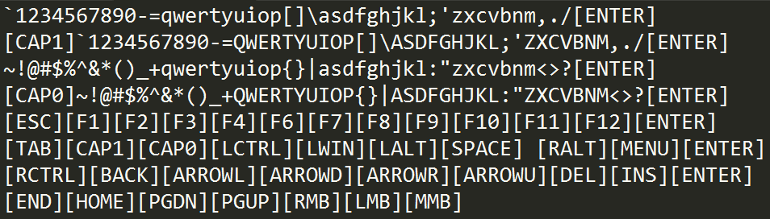

## Synopsis
This is a basic Windows-only keylogger in C++ for US standard keyboards. 

US standard keyboard layout:


## Description 
This keylogger supports the following characters and symbols:
```
[ESC][F1][F2][F3][F4][F5][F6][F7][F8][F9][F10][F11][F12]
`1234567890-=
~!@#$%^&*()_+
qwertyuiop[]\asdfghjkl;'zxcvbnm,./
QWERTYUIOP{}|ASDFGHJKL:"ZXCVBNM<>?
[TAB][C0][C1][SHIFT][LCTRL][LWIN][LALT][SPACE][RALT][RWIN][MENU][RCTRL][ENTER][BACK]
[DEL][INS][END][HOME][PGDN][PGUP][ARROWD][ARROWU][ARROWL][ARROWR] 
```

## Usage
1. Open *keylogger.cpp* and change the maximum number of key strokes you wish to record (*max* constant)
2. Compile with MinGW: g++ keylogger.cpp -o keylogger.exe
3. Run *keylogger.exe*
4. The program will terminate after a certain number(*max* constant) of key strokes.
5. Inspect *log.txt*

Note: Disable any antivirus software. 

## Output
*log.txt* output:


## Contribution
Feel free to be part of this project by creating a pull request. Questions or suggestions are more than welcomed.

## To do
- *Send Mail* option

# Disclaimer
This software is for educational purposes only. No responsibility is held or accepted for misuse.

## License
&copy; 2016 Marios Sofokleous

Licensed under the [MIT License](LICENSE)
